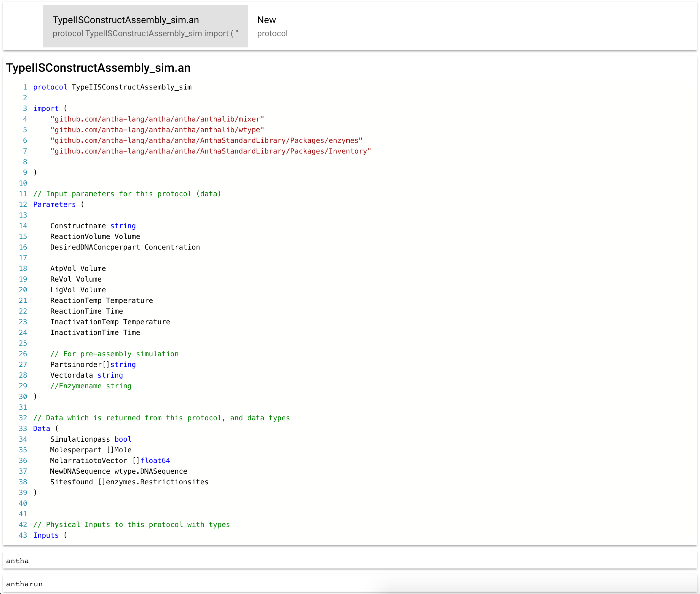

# Monaco-based Antha Editor

This is a fork of https://github.com/alexandrudima/monaco-languages to support [Antha](https://www.antha-lang.org/).



## Build

```sh
git clone git@github.com:mbana/monaco-languages.git
cd monaco-languages
npm start
```

or if the above fails:

```sh
gulp compile
gulp release
http-server -c-1 ./ -p 8888
```

```sh
Starting up http-server, serving ./
Available on:
http://127.0.0.1:8888
http://192.168.0.4:8888
http://192.168.99.1:8888
```

**NB:**

I think it's possible to do all this without starting a server, it seems Chrome doesn't allow loading of local files from within a script.

If you run into path issues let me know, I myself, could not get the editor running on the first go. It's best to fix such issues early.

## TODO

* Update Monaco's model once file has been fetched.
* Call into Antha.
* Hooks already do crude form of dynamic fetching of Antha files. Need to fetch these...


